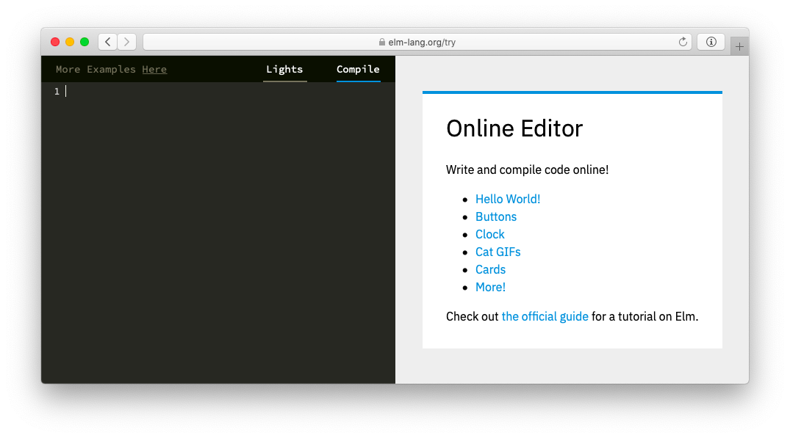

# The Elm Architecture

The Elm Architecture is a pattern for architecting interactive programs, like webapps and games.

This architecture seems to emerge naturally in Elm. Rather than someone inventing it, early Elm programmers kept discovering the same basic patterns in their code. It was kind of spooky to see people ending up with well-architected code without planning ahead!

So The Elm Architecture is easy in Elm, but it is useful in any front-end project. In fact, projects like Redux have been inspired by The Elm Architecture, so you may have already seen derivatives of this pattern. Point is, even if you ultimately cannot use Elm at work yet, you will get a lot out of using Elm and internalizing this pattern.


## The Basic Pattern

The logic of every Elm program breaks into three parts:

  * **Model** &mdash; the state of your application
  * **Update** &mdash; a way to update your state
  * **View** &mdash; a way to view your state as HTML

So I always start with the following skeleton and fill in details for my particular case.

```elm
import Html exposing (..)


-- MODEL

type alias Model = { ... }


-- UPDATE

type Msg = ...

update : Msg -> Model -> Model
update msg model =
  ...


-- VIEW

view : Model -> Html Msg
view model =
  ...

```

That is the essence of The Elm Architecture. We will proceed by filling in this skeleton with increasingly interesting logic.


# The Elm Architecture + User Input

Your web app is going to need to deal with user input. This section will get you familiar with The Elm Architecture in the context of things like:

  - Buttons
  - Text Fields
  - Check Boxes
  - Radio Buttons
  - etc.

We will go through a few examples that build knowledge gradually, so go in order!


## Follow Along

The following examples are all available in the online editor:

[](https://elm-lang.org/try)

This editor shows hints in the top left corner:

<video id="hints-video" width="298" height="132" autoplay loop style="margin: 0.55em 0 1em 2em;" onclick="var v = document.getElementById('hints-video'); v.paused ? (v.play(), v.style.opacity = 1) : (v.pause(), v.style.opacity = 0.5)">
  <source src="hints.mp4" type="video/mp4">
</video>

Hopefully this will be helpful as you work through the upcoming examples!
