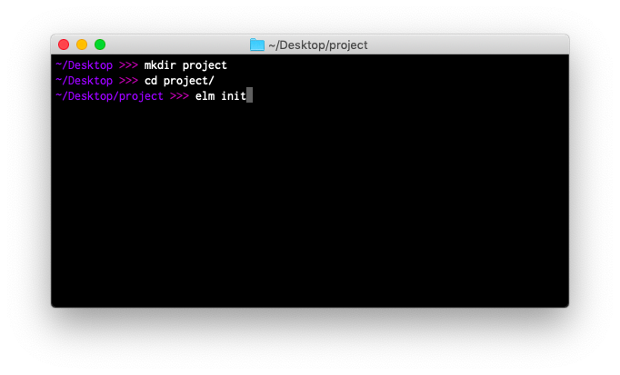

# Terminal

You just set up a code editor so you can edit Elm files locally, so the next step is to obtain an executable file named `elm`. This file can help you start projects, compile Elm code, install packages, and a bunch of other stuff!


## Install

Click the relevant link:

- [Mac](https://github.com/elm/compiler/releases/download/0.19.0/installer-for-mac.pkg)
- <a href="https://github.com/elm/compiler/blob/master/installers/linux/README.md" target="_blank">Linux</a>
- [Windows](https://github.com/elm/compiler/releases/download/0.19.0/installer-for-windows.exe)

It will walk you through the install process!

> **Aside:** There are [past versions](https://github.com/elm/compiler/releases) and [uninstall directions](https://github.com/elm/compiler/tree/master/installers/README.md) available if needed.


## Open the Terminal

Start by opening up the terminal on your computer. It may be called `cmd.exe` or `Command Prompt` on Windows.



Navigate to your desktop. This can be done with `cd ~/Desktop` on Mac and Linux. It would be something like `cd C:\Users\<username>\Desktop` on Windows.


## Try out Elm!

The next step is to get familiar with `elm` command. I personally had a really hard time learning terminal commands, so I worked hard to make the `elm` command nice to use.

Let's go through a couple of common uses.


### `elm init`

You can start an Elm project by running:

```bash
elm init
```

It just creates an `elm.json` file and a `src/` directory:

- `elm.json` describes your project.
- `src/` holds all of your Elm files.

Now try creating a file called `src/Main.elm` in your editor, and copying in the code from [the buttons example](https://elm-lang.org/examples/buttons).


### `elm reactor`

`elm reactor` helps you build Elm projects without messing with the terminal too much. You just run it at the root of your project, like this:

```bash
elm reactor
```

This starts a server at [`http://localhost:8000`](http://localhost:8000). You can navigate to any Elm file and see what it looks like. Try to check out your `src/Main.elm` file!


### `elm make`

You can compile Elm code to HTML or JavaScript with commands like this:

```bash
# Create an index.html file that you can open in your browser.
elm make Main.elm

# Create an optimized JS file to embed in a custom HTML document.
elm make Main.elm --optimize --output=elm.js
```

These commands should print out helpful error messages if anything goes wrong.

This is the most general way to compile Elm code. It is extremely useful once your project becomes too advanced for `elm reactor`.

> **Note:** This command produces the same messages you have been seeing in the online editor and with `elm reactor`. Years of work has gone into them so far, but please report any unhelpful messages [here](https://github.com/elm/error-message-catalog/issues). I am sure there are ways to improve!


### `elm install`

Elm packages all live at [`package.elm-lang.org`](https://package.elm-lang.org/).

Say you look around and decide you need [`elm/http`][http] and [`elm/json`][json] to make some HTTP requests. You can get them set up in your project with the following commands:

```bash
elm install elm/http
elm install elm/json
```

This will add the dependencies into your `elm.json` file, described in more detail [here](https://github.com/elm/compiler/blob/master/docs/elm.json/application.md).

[http]: https://package.elm-lang.org/packages/elm/http/latest
[json]: https://package.elm-lang.org/packages/elm/json/latest


## Tips and Tricks

**First**, do not worry about remembering it all this stuff!

You can always run `elm --help` to get a full outline of what `elm` is capable of.

You can also run commands like `elm make --help` and `elm repl --help` to get hints about a specific command. This is great if you want to check which flags are available and what they do.

**Second**, do not worry if it takes some time to get comfortable with the terminal in general.

I have been using it for over a decade now, and I still cannot always remember how to unzip files or find files with certain file extensions. I still look it up!

Nonetheless, I find myself writing bash scripts rather than using a build system for my personal projects. Scripts like [this](https://github.com/evancz/guide.elm-lang.org/blob/master/build.sh) and [this](https://github.com/elm/elm-lang.org/blob/master/build.sh) have ended up being easier to maintain than alternative approaches. Maybe that is just me though!
